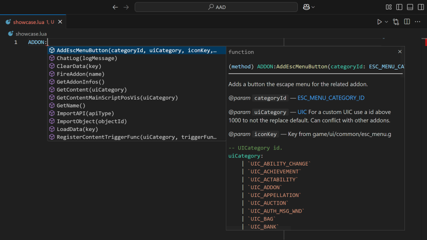
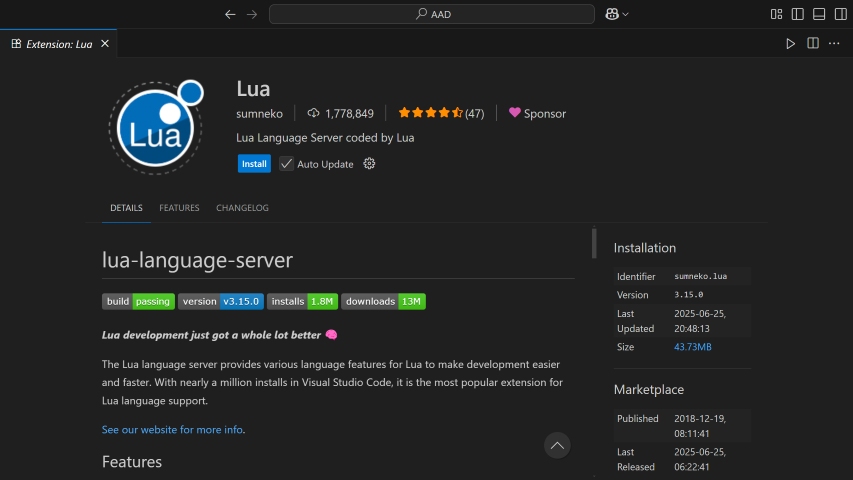

# ArcheAge Addon Definitions
Provides documentation, definitions, and IntelliSense for ArcheAge Addons.




## How to use IntelliSense ([VSCode](https://code.visualstudio.com/))
1. Clone or [download this repo](https://github.com/Noviern/AAAD/archive/refs/heads/master.zip).
2. Extract and place in `C:\ArcheRage\Documents\Addon`
3. Install VSCode Extension [Lua](https://marketplace.visualstudio.com/items?itemName=sumneko.lua).



4. Open settings and search for
```
lua.workspace.library
(optional) Lua.runtime.version - Set to Lua 5.1 to match the version of Lua ArcheAge supports.
```

5. Determine if you want definitions for all addons (User) or just one specific addon (Workspace).
6. Click **Add Item** and provide the location of this folder (`C:\ArcheRage\Documents\Addon\AAD`)


## How to use globals
In your addon's toc.g add at the top
```
..\AAD\globals.lua
```