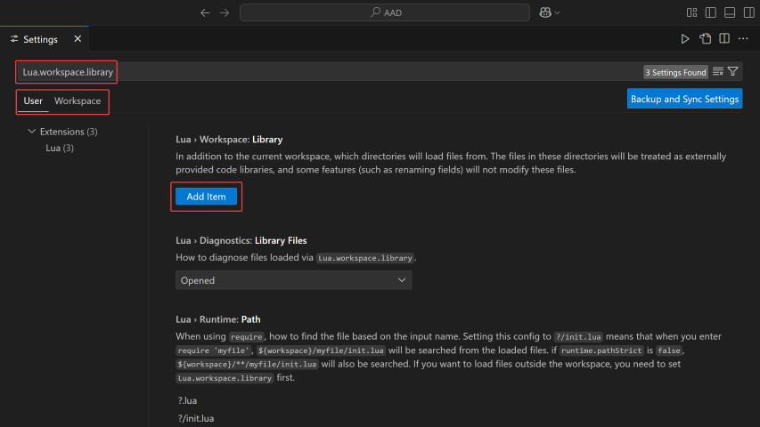

# ArcheAge Addon Definitions

Provides documentation, definitions, and IntelliSense for ArcheAge Addons.

<video src="https://github.com/user-attachments/assets/58f3a023-522a-462b-83c2-f876a320daa0"></video>

## How To Use IntelliSense ([VSCode](https://code.visualstudio.com/))
1. Clone or download this repo.
2. Extract and place in `C:/ArcheRage/Documents/Addon`.
3. Install VSCode Extension [Lua](https://marketplace.visualstudio.com/items?itemName=sumneko.lua).


4. Open settings and search for
```
Lua.workspace.library
```

5. Determine if you want definitions for all addons (User) or just one specific addon (Workspace).
6. Click **Add Item** and provide the location of this folder (`C:/ArcheRage/Documents/Addon/AAAD/src`).



### Optional Settings

- `Lua.runtime.version` = `5.1` — Set to Lua 5.1 to match the version used by ArcheAge.
- `Lua.hover.expandAlias` = `false` — Aliases expand by default which can make it harder to read documentation.
- `Lua.diagnostics.disable` = `need-check-nil` — Suppresses warnings for unchecked `nil` values (widgets/objects may be `nil`).

## How To Use Globals
In your addon's toc.g add at the top
```
../AAAD/src/globals.lua
```

## Extra
If you would like some extra dev tools for developing addons visit [DEVTOOLS.md](doc/DEVTOOLS.md).

If you would like to contribute to this project visit [CONTRIBUTING.md](CONTRIBUTING.md).
